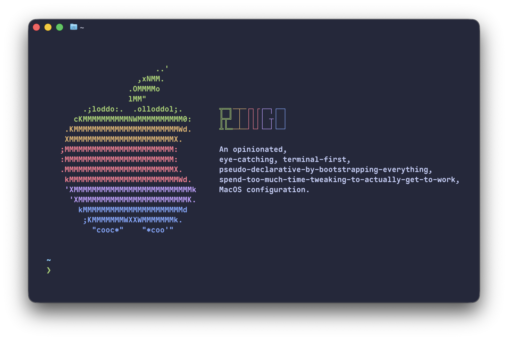

# About Ringo

Ringo comes from my need of an easy way to reproduce my MacOS development environment.
In the past, this desire is held by my lack of understanding for those configuring and scripting languages.
But for now, it is no longer a problem with the help of AI.
Still, I would like to gain experience while I make Ringo, so I would always prefer tools I have not used before,
and **AI would only be used for querying information, all code should be edited by me**.
